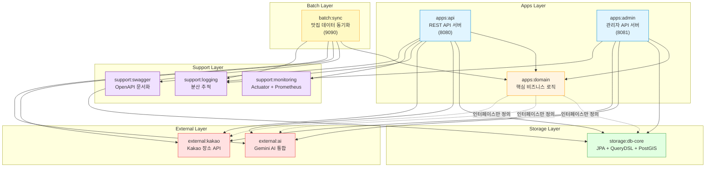
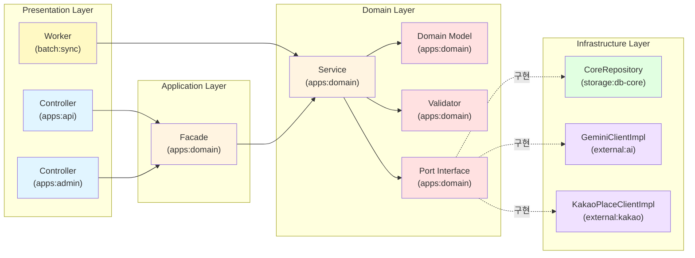
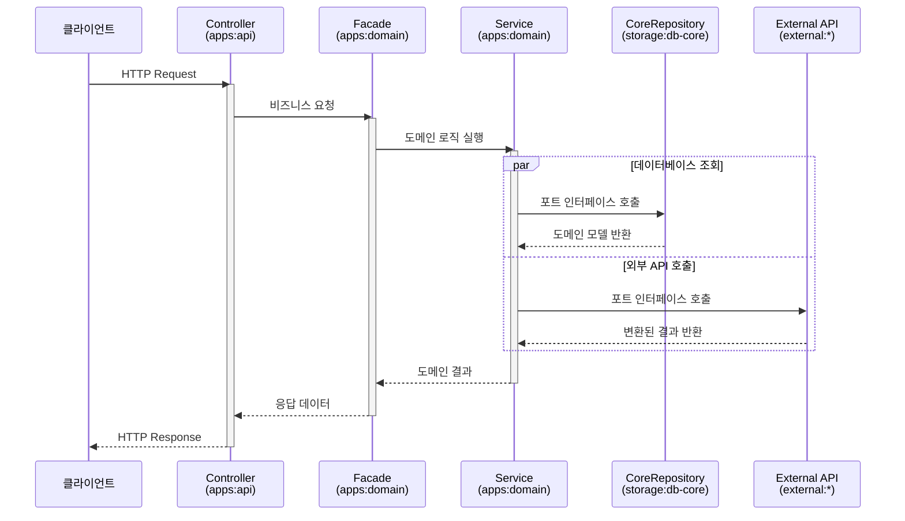
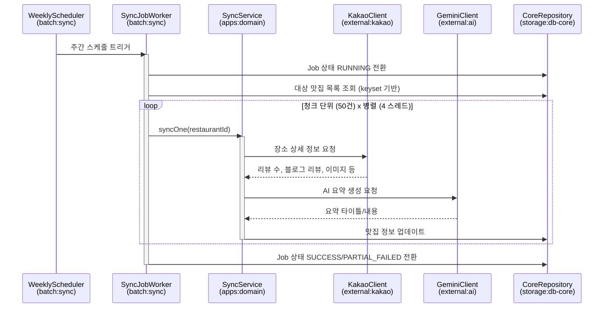
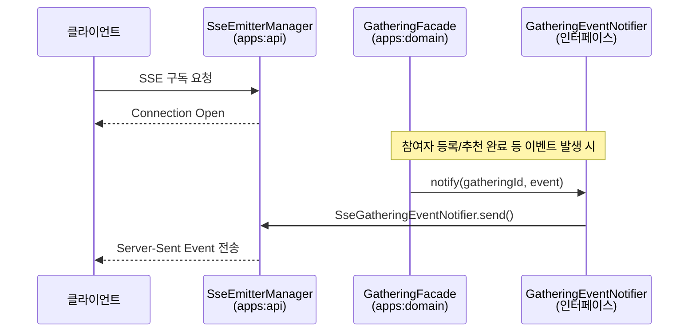
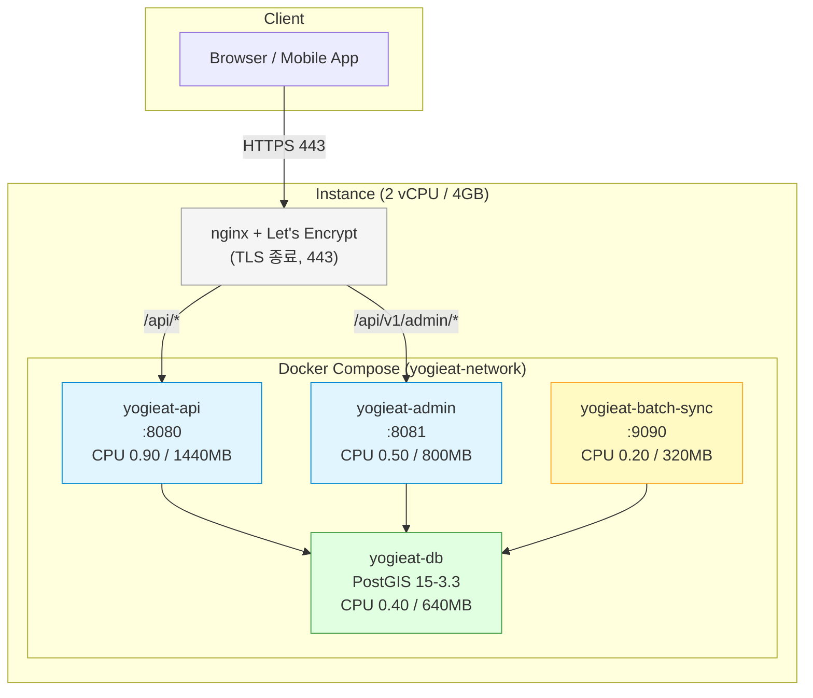
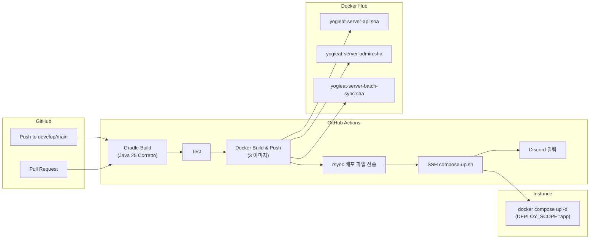

# Yogieat Server — 멀티모듈 아키텍처

> 최종 업데이트: 2026-03-09

## 프로젝트 소개

Yogieat은 **모임 참여자의 음식 취향을 투표로 수집하고, AI 기반 추천 알고리즘으로 최적의 맛집 Top 3를 자동 산출**하는 서비스입니다.

이 서버는 클린 아키텍처 원칙에 따라 **10개 Gradle 모듈**로 구성된 멀티모듈 구조를 채택하여, 계층별 책임 분리와 독립적 배포를 실현합니다.

---

## 왜 이 아키텍처를 선택했는가

### 문제 인식

모놀리식 구조에서 시작한 프로젝트는 다음 문제에 직면했습니다.

1. **비즈니스 로직과 인프라 코드의 결합** — 도메인 서비스가 JPA Entity, 외부 API 클라이언트에 직접 의존하여 테스트와 변경이 어려움
2. **의존성 방향의 혼재** — Controller → Service → Repository 흐름이 명확하지 않아 순환 참조 위험 존재
3. **배포 단위의 비효율** — API, Admin, Batch가 하나의 JAR로 묶여 부분 변경에도 전체 재배포 필요

### 설계 판단

| 판단 기준 | 선택 | 이유 |
|:--|:--|:--|
| 모듈 분리 전략 | 계층형 멀티모듈 | 도메인 순수성 보장 + 배포 단위 독립 |
| 도메인 모듈 의존성 | 프레임워크 최소 의존 | 비즈니스 로직의 이식성과 테스트 용이성 |
| 외부 통합 분리 | `external:*` 모듈 | 외부 API 변경이 도메인에 전파되지 않도록 격리 |
| 애플리케이션 분리 | API / Admin / Batch 별도 JAR | 역할별 독립 배포 및 리소스 최적화 |

---

## 기술 스택

| 구분 | 기술 |
|:--|:--|
| 언어 | Java 25 (Corretto) |
| 프레임워크 | Spring Boot 3.5.9 |
| 빌드 | Gradle 멀티모듈 |
| ORM | Spring Data JPA + QueryDSL 7.1 |
| 데이터베이스 | PostgreSQL 15 + PostGIS 3.3 (공간 데이터) |
| AI 통합 | Google Gemini (GenAI SDK 1.10.0) |
| 외부 API | Kakao 장소 검색 API |
| 인증 | JWT (jjwt 0.12.6) + Spring Security (Admin 전용) |
| API 문서화 | SpringDoc OpenAPI 2.8.5 |
| 모니터링 | Spring Actuator + Micrometer + Prometheus |
| 동시성 | Virtual Thread (배치 동기화, 비동기 이벤트, SSE) |
| 분산 추적 | Micrometer Tracing (Brave) |
| 코드 품질 | Spotless (자동 포맷팅 + import 정리) |
| 컨테이너 | Docker Compose (API / Admin / Batch / DB) |
| CI/CD | GitHub Actions → Docker Hub → 인스턴스 배포 |
| 알림 | Discord Webhook (빌드/배포 알림) |

---

## 모듈 구조 전체 맵



> **핵심 원칙**: `apps:domain`은 프레임워크에 의존하지 않는 순수 비즈니스 로직 모듈입니다. Spring Context, Spring TX, SLF4J만 사용하며, JPA/HTTP 클라이언트 등 인프라 구현을 알지 못합니다.

---

## 모듈별 상세 설명

### Apps Layer — 애플리케이션 계층

#### `apps:api` (REST API 서버)

사용자 클라이언트를 위한 REST API 진입점이며, 실행 가능한 JAR(`bootJar`)를 생성합니다.

| 항목 | 내용 |
|:--|:--|
| 포트 | 8080 |
| 책임 | HTTP 요청/응답, 입력 검증, SSE 실시간 이벤트 전송, 스케줄링 |
| 주요 구성 | Controller, Request/Response DTO, GlobalExceptionHandler |
| 실시간 통신 | SSE(Server-Sent Events) 기반 모임 이벤트 알림 |
| 스케줄러 | 추천 결과 Pending 정리, 맛집 수집 스케줄러 |
| 의존 모듈 | domain, db-core, ai, kakao, swagger, monitoring, logging |

주요 API 엔드포인트:

| 도메인 | Controller | 기능 |
|:--|:--|:--|
| 모임 | `GatheringController` | 모임 생성, 조회, SSE 구독 |
| 참여자 | `ParticipantController` | 참여자 등록, 닉네임 검증 |
| 추천 | `RecommendResultController` | 추천 실행, 결과 조회, 랭킹 |
| 맛집 동기화 | `RestaurantSyncJobController` | 전체/단건 동기화 Job 트리거 |
| 카테고리 | `CategoryController` | 카테고리 목록 조회 |
| 사용자 | `UserController` | 사용자 정보 |

#### `apps:admin` (관리자 API 서버)

관리자 전용 API 서버로, **JWT 인증 + Spring Security** 기반 접근 제어를 수행합니다.

| 항목 | 내용 |
|:--|:--|
| 포트 | 8081 |
| 책임 | 관리자 인증/인가, 관리 기능 API |
| 인증 방식 | JWT (Access Token + Refresh Token) |
| 보안 | Spring Security + JwtAuthenticationFilter |
| 의존 모듈 | domain, db-core, ai, kakao, logging |

주요 API 엔드포인트:

| 도메인 | Controller | 기능 |
|:--|:--|:--|
| 인증 | `AuthController` | 로그인, 로그아웃, 토큰 갱신 |
| 맛집 관리 | `RestaurantAdminController` | 맛집 목록 조회, 수정, 삭제 |
| 모임 관리 | `GatheringAdminController` | 모임 목록 조회, 관리 |
| 카테고리 관리 | `CategoryAdminController` | 카테고리 관리 |
| 지역 관리 | `RegionAdminController` | 지역 정보 관리 |

#### `apps:domain` (핵심 비즈니스 로직)

**프레임워크에 최소한으로 의존하는 순수 도메인 모듈**입니다. 이 모듈의 독립성이 전체 아키텍처의 핵심입니다.

| 항목 | 내용 |
|:--|:--|
| 의존성 | `spring-context`, `spring-tx`, `spring-web`, `jackson-databind`, `slf4j-api` |
| 책임 | 비즈니스 규칙, 도메인 모델, 포트 인터페이스 정의 |
| 플러그인 | `java-library` (라이브러리 모듈) |

**의존성 역전(DIP) 구현**:

```
apps:domain (포트 인터페이스 정의)
  ├── RestaurantRepository        ← storage:db-core가 구현
  ├── GatheringRepository         ← storage:db-core가 구현
  ├── ParticipantRepository       ← storage:db-core가 구현
  ├── RecommendResultRepository   ← storage:db-core가 구현
  ├── GatheringEventNotifier      ← apps:api(SSE), apps:admin, batch:sync가 각각 구현
  └── (Kakao Client 인터페이스)   ← external:kakao가 구현
```

도메인 패키지 구조:

| 패키지 | 역할 | 주요 클래스 |
|:--|:--|:--|
| `gathering` | 모임 도메인 | Gathering, GatheringFacade, GatheringService, GatheringValidator |
| `participant` | 참여자 도메인 | Participant, ParticipantFacade, ParticipantService, ParticipantAnalyzer |
| `restaurant` | 맛집 도메인 | Restaurant, RestaurantService, RestaurantCollectionProcessor |
| `restaurant.sync` | 맛집 동기화 | RestaurantSyncJob, RestaurantSyncJobService, RestaurantSyncService |
| `recommend` | 추천 도메인 | RecommendationProcessor, RecommendationContextFactory, CategoryQuotaSelectionStrategy |
| `category` | 카테고리 도메인 | Category, CategoryService, LargeCategory |
| `admin` | 관리자 도메인 | Admin, AdminService |
| `user` | 사용자 도메인 | User, UserService |
| `common` | 공통 유틸리티 | GeoUtils, GeoJson, Region, ErrorCode, CustomException |

### Batch Layer — 배치 처리 계층

#### `batch:sync` (맛집 데이터 동기화)

외부 API(Kakao, Gemini)로부터 맛집 정보를 주기적으로 동기화하는 배치 애플리케이션입니다.

| 항목 | 내용 |
|:--|:--|
| 포트 | 9090 (외부 노출 안 함) |
| 실행 방식 | 주간 스케줄 + 수동 API 트리거 |
| 처리 방식 | 청크 처리(50건) + Virtual Thread 병렬 실행 + Semaphore 동시성 제어 + 청크 재시도(최대 2회) |
| 상태 관리 | `t_restaurant_sync_job` 테이블 기반 |
| 실행 스코프 | ALL(전체 동기화), SINGLE(단건 동기화) |
| 의존 모듈 | domain, db-core, kakao, ai, logging |

주요 클래스:

| 클래스 | 역할 |
|:--|:--|
| `SyncBatchApplication` | 배치 애플리케이션 엔트리포인트 |
| `RestaurantSyncJobWorker` | 청크 단위 동기화 실행 엔진 |
| `RestaurantSyncWeeklyScheduler` | 주간 자동 실행 스케줄러 |
| `SyncJobProperties` | 청크 크기, 병렬도 설정 |
| `SyncWorkerConfig` | 워커 스레드 풀 설정 |

### External Layer — 외부 서비스 통합 계층

#### `external:ai` (Gemini AI 통합)

Google Gemini API를 활용하여 맛집의 AI 요약(메이트 요약 타이틀/내용)을 생성합니다.

| 항목 | 내용 |
|:--|:--|
| SDK | Google GenAI SDK 1.10.0 |
| 주요 클래스 | GeminiClientImpl, GeminiPromptBuilder, GeminiResponseParser |
| 용도 | 맛집 리뷰 요약, 키워드 추출, 추천 점수 부스트 판단 |

#### `external:kakao` (Kakao 장소 API 통합)

Kakao 장소 검색 및 상세 정보 조회를 담당합니다.

| 항목 | 내용 |
|:--|:--|
| 주요 클래스 | KakaoPlaceClientImpl, KakaoPlaceDetailClientImpl, KakaoPlaceDetailParser, KakaoPlaceMapperImpl |
| 관리자 전용 | KakaoAdminKakaoApiExecutor (관리자 맛집 수집용), KakaoAdminClientProperties (관리자 API 설정) |
| 용도 | 장소 검색, 상세 정보(리뷰 수, 블로그 리뷰 수, 이미지 등) 수집 |

### Storage Layer — 데이터 영속성 계층

#### `storage:db-core`

JPA Entity, Repository 구현체, QueryDSL 쿼리를 포함하는 데이터 접근 계층입니다.

| 항목 | 내용 |
|:--|:--|
| ORM | Spring Data JPA + Hibernate 6.6.10 |
| 쿼리 빌더 | QueryDSL 7.1 |
| 공간 데이터 | Hibernate Spatial + PostGIS |
| DB | PostgreSQL 15 |
| 패키지 | `com.yogieat.datasource.db.core` |
| 의존성 노출 | `api` 키워드로 JPA Starter를 상위 모듈에 전이 |

엔티티/레포지토리 구성:

| 도메인 | Entity | Repository (Core) | JPA Repository |
|:--|:--|:--|:--|
| 맛집 | RestaurantEntity | RestaurantCoreRepository | RestaurantJpaRepository |
| 동기화 Job | RestaurantSyncJobEntity | RestaurantSyncJobCoreRepository | RestaurantSyncJobJpaRepository |
| 모임 | GatheringEntity | GatheringCoreRepository | GatheringJpaRepository |
| 참여자 | ParticipantEntity | ParticipantCoreRepository | ParticipantJpaRepository |
| 추천 결과 | RecommendResultEntity | RecommendResultCoreRepository | — |
| 추천 실패 | RecommendResultFailedEntity | RecommendResultFailedCoreRepository | — |
| 카테고리 | CategoryEntity | CategoryCoreRepository | CategoryJpaRepository |
| 관리자 | AdminEntity | AdminCoreRepository | AdminJpaRepository |
| 사용자 | UserEntity | UserCoreRepository | UserJpaRepository |

> **설계 포인트**: `CoreRepository`는 `apps:domain`에서 정의한 포트 인터페이스(`RestaurantRepository` 등)를 구현하는 어댑터입니다. 도메인은 JPA를 직접 알지 못하고, CoreRepository가 도메인 모델과 JPA Entity 간 변환을 담당합니다.

### Support Layer — 횡단 관심사 계층

| 모듈 | 책임 | 핵심 기술 |
|:--|:--|:--|
| `support:logging` | 분산 추적 | Micrometer Tracing + Brave |
| `support:monitoring` | 메트릭 수집/노출 | Spring Actuator + Micrometer + Prometheus |
| `support:swagger` | API 문서 자동 생성 | SpringDoc OpenAPI 2.8.5 (`api` 키워드로 어노테이션 전이) |

---

## 클린 아키텍처 계층 흐름



**의존성 방향**: Presentation → Application → Domain ← Infrastructure

도메인 계층은 인프라에 의존하지 않고, 인프라가 도메인이 정의한 포트 인터페이스를 구현합니다.

---

## 모듈별 데이터 흐름

### 사용자 API 요청 흐름



### 배치 동기화 흐름



### SSE 실시간 이벤트 흐름



---

## 의존성 관리 전략

### Gradle 플러그인 전략

```gradle
subprojects {
    // 실행 가능한 애플리케이션: java 플러그인 + bootJar 활성화
    if (project.path.startsWith(':apps:api')
            || project.path.startsWith(':apps:admin')
            || project.path.startsWith(':batch:sync')) {
        apply plugin: 'java'
    }
    // 라이브러리 모듈: java-library 플러그인
    else {
        apply plugin: 'java-library'
    }
}
```

| 모듈 유형 | Gradle 플러그인 | bootJar | 비고 |
|:--|:--|:--|:--|
| apps:api | `java` | 활성 | 메인 API 서버 |
| apps:admin | `java` | 활성 | 관리자 API 서버 |
| batch:sync | `java` | 활성 | 배치 프로세스 |
| apps:domain | `java-library` | 비활성 | 순수 비즈니스 로직 |
| storage:db-core | `java-library` | 비활성 | 데이터 접근 |
| external:* | `java-library` | 비활성 | 외부 통합 |
| support:* | `java-library` | 비활성 | 횡단 관심사 |

### `api` vs `implementation` 의존성 전이

- **`api`**: 의존성을 상위 모듈에 전이 노출
  - `support:swagger` → SpringDoc 어노테이션(`@Operation`, `@Schema`)을 `apps:api`에서 사용 가능
  - `storage:db-core` → JPA Starter를 상위 모듈에 전이

- **`implementation`**: 내부에서만 사용, 외부 노출 안 함
  - 대부분의 라이브러리 의존성

### `apps:domain`의 의존성 최소화

```gradle
// apps:domain/build.gradle
dependencies {
    implementation 'org.springframework:spring-context'
    implementation 'org.springframework:spring-tx'
    implementation 'org.springframework:spring-web'
    implementation 'org.springframework.boot:spring-boot-autoconfigure'
    implementation 'com.fasterxml.jackson.core:jackson-databind'
    implementation 'org.slf4j:slf4j-api'
}
```

> **설계 의도**: JPA, HTTP Client, 외부 SDK 등 인프라 기술에 의존하지 않아, 비즈니스 로직을 단독으로 단위 테스트할 수 있습니다.

---

## 배포 아키텍처

### 런타임 토폴로지



### CI/CD 파이프라인



| 워크플로우 | 트리거 | 동작 |
|:--|:--|:--|
| `develop_build_deploy.yml` | develop push | 빌드 → 3개 이미지 push → DEV 서버 배포 |
| `develop_pull_request_build.yml` | develop PR | 빌드 + 테스트만 |
| `production_build_deploy.yml` | main push | 빌드 → 3개 이미지 push → PROD 서버 배포 |
| `production_deploy.yml` | 수동 | 기존 이미지로 PROD 재배포 |
| `pr-automation.yml` | PR | PR 자동화 |

### 배포 전략

- **DEPLOY_SCOPE=app**: API/Admin/Batch만 재배포 (DB는 기존 컨테이너 유지)
- **DEPLOY_SCOPE=full**: DB 포함 전체 재배포 (유지보수 창에서만 사용)
- 이미지 태그: Git SHA 기반으로 정확한 커밋 추적 가능
- DB 자동 복구: `AUTO_RESTORE_DB=true`로 DB 컨테이너 소실 시 자동 기동
- 환경 분리: `docker-compose.dev.yaml` / `docker-compose.prod.yaml` 오버레이

---

## 아키텍처 설계 원칙

### 1. 의존성 역전 원칙 (DIP)

`apps:domain`은 인프라를 알지 못합니다. Repository, Client 등의 포트 인터페이스만 정의하고, `storage:db-core`와 `external:*`이 이를 구현합니다.

```
[도메인이 정의]              [인프라가 구현]
RestaurantRepository  ←───  RestaurantCoreRepository (storage:db-core)
GatheringEventNotifier ←─── SseGatheringEventNotifier (apps:api)
                       ←─── AdminGatheringEventNotifierConfig (apps:admin)
                       ←─── SyncGatheringEventNotifierConfig (batch:sync)
```

> **포트폴리오 관점**: 동일한 도메인 인터페이스(`GatheringEventNotifier`)를 API(SSE), Admin, Batch 모듈이 각각의 맥락에 맞게 구현합니다. 이는 DIP를 실전에서 적용한 사례입니다.

### 2. 단일 책임 원칙 (SRP)

각 모듈은 하나의 명확한 책임을 가지며, 변경 이유가 다른 코드는 다른 모듈에 배치합니다.

| 변경 이유 | 영향 모듈 |
|:--|:--|
| API 스펙 변경 | apps:api 또는 apps:admin |
| 비즈니스 규칙 변경 | apps:domain |
| DB 스키마 변경 | storage:db-core |
| Kakao API 스펙 변경 | external:kakao |
| 배치 스케줄 변경 | batch:sync |

### 3. 개방-폐쇄 원칙 (OCP)

새로운 외부 서비스 추가 시 `external` 하위에 모듈을 추가하고, 도메인 포트 인터페이스 구현체를 등록하면 됩니다. 기존 코드 수정 없이 확장 가능합니다.

### 4. 계층 경계 엄수

- 의존성 방향: 항상 외부 → 내부(도메인)
- Controller는 Facade만 호출하며, Service를 직접 호출하지 않음
- Service는 Repository/Client 인터페이스만 사용하며, 구현체를 알지 못함

---

## 리팩토링 히스토리

프로젝트 진행 중 아래 아키텍처 개선을 단계적으로 적용했습니다.

| 시점 | 개선 내용 | 효과 |
|:--|:--|:--|
| 초기 | 모놀리식 → 멀티모듈 전환 | 계층별 책임 분리, 빌드 성능 개선 |
| 중기 | Kakao 구현체를 domain → external:kakao로 이동 | 도메인 순수성 확보 |
| 중기 | 루트 build.gradle 광역 의존성 제거, 모듈별 명시 | 모듈별 최소 의존 원칙 |
| 중기 | db-core Entity/Repository 스캔 범위를 `com.yogieat.datasource.db.core`로 축소 | 모듈 경계 누수 방지 |
| 중기 | Admin 모듈 분리 (API → API + Admin) | 인증 체계 독립, 리소스 분리 |
| 후기 | Batch 모듈 분리 | 배치 프로세스 독립 배포 |
| 후기 | SSE 기반 실시간 이벤트 도입 | 폴링 제거, 사용자 경험 개선 |

---

## 프로젝트 디렉터리 요약

```
yogieat-server/
├── apps/
│   ├── api/          # REST API 서버 (bootJar, :8080)
│   ├── admin/        # 관리자 API 서버 (bootJar, :8081, JWT+Security)
│   └── domain/       # 순수 비즈니스 로직 (java-library)
├── batch/
│   └── sync/         # 맛집 동기화 배치 (bootJar, :9090)
├── external/
│   ├── ai/           # Gemini AI 통합 (java-library)
│   └── kakao/        # Kakao 장소 API 통합 (java-library)
├── storage/
│   └── db-core/      # JPA + QueryDSL + PostGIS (java-library)
├── support/
│   ├── logging/      # 분산 추적 (Brave)
│   ├── monitoring/   # Actuator + Prometheus
│   └── swagger/      # OpenAPI 문서화
├── docker/           # Dockerfile, Compose 파일
├── scripts/          # 배포, 동기화, 측정 스크립트
├── docs/             # 아키텍처/운영 문서
└── .github/workflows/ # CI/CD 파이프라인
```
