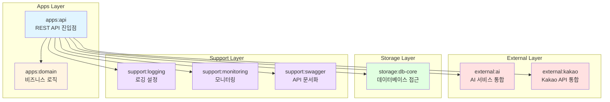
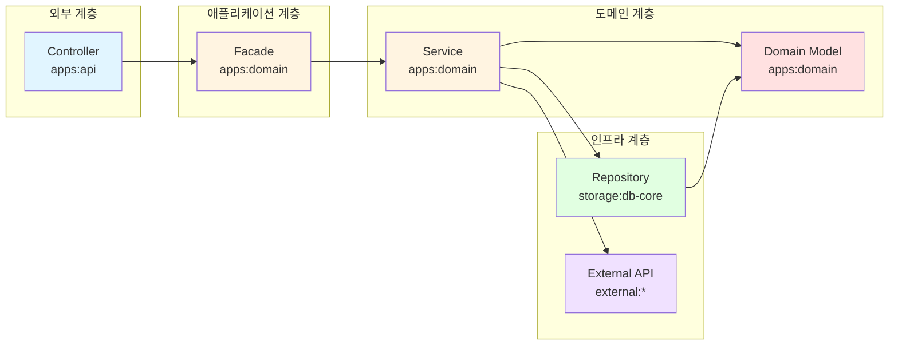
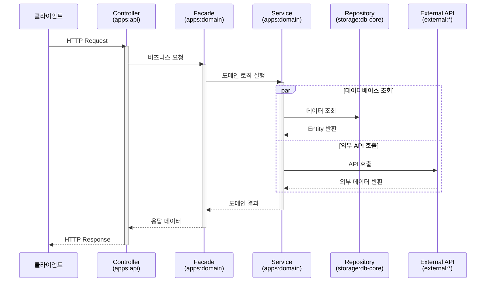

# 멀티모듈 아키텍처 구조

## 개요

Yogieat 서버는 모놀리식 아키텍처에서 멀티모듈 아키텍처로 전환하여, 클린 아키텍처 원칙에 따라 계층별 책임을 명확히 분리한다.

## 모듈 구조



## 계층별 책임

### Apps Layer (애플리케이션 계층)

#### apps:api
- **책임**: REST API 진입점, HTTP 요청/응답 처리
- **포함**: Controller, Request/Response DTO, Global Exception Handler
- **의존성**: 모든 하위 모듈에 의존
- **플러그인**: `java` (실행 가능한 애플리케이션)

#### apps:domain
- **책임**: 핵심 비즈니스 로직 및 도메인 모델
- **포함**: Domain Entity, Service, Facade, Validator, Event
- **의존성**: 외부 모듈에 의존하지 않음 (순수 비즈니스 로직)
- **플러그인**: `java-library`

### External Layer (외부 통합 계층)

#### external:ai
- **책임**: AI 서비스 통합 (Gemini API)
- **포함**: GeminiClient, GeminiPromptBuilder, GeminiResponseParser
- **플러그인**: `java-library`

#### external:kakao
- **책임**: Kakao API 통합 (지도, 장소 검색)
- **포함**: KakaoPlaceClientImpl, KakaoPlaceDetailClientImpl, KakaoPlaceMapperImpl, KakaoPlaceDetailParser
- **플러그인**: `java-library`

### Storage Layer (데이터 저장소 계층)

#### storage:db-core
- **책임**: 데이터베이스 접근 및 영속성 관리
- **포함**: JPA Entity, Repository, QueryDSL
- **플러그인**: `java-library`

### Support Layer (기술 지원 계층)

#### support:logging
- **책임**: 로깅 설정 및 관리
- **포함**: Logback 설정 파일
- **플러그인**: `java-library`

#### support:monitoring
- **책임**: 애플리케이션 모니터링
- **포함**: Actuator, Micrometer 설정
- **플러그인**: `java-library`

#### support:swagger
- **책임**: API 문서화
- **포함**: SpringDoc OpenAPI 설정
- **의존성 전이**: `api` 키워드를 사용하여 어노테이션을 apps:api에서 사용 가능
- **플러그인**: `java-library`

## 클린 아키텍처 계층 흐름



## 의존성 관리

### Gradle 플러그인 전략

```gradle
// 루트 build.gradle
subprojects {
    // 애플리케이션 모듈: java 플러그인
    if (project.path.startsWith(':apps:api')) {
        apply plugin: 'java'
    }
    // 라이브러리 모듈: java-library 플러그인
    else {
        apply plugin: 'java-library'
    }
}
```

### api vs implementation

- **`api`**: 의존성을 외부로 노출 (다른 모듈에서 사용 가능)
  - 예시: `support:swagger` 모듈이 SpringDoc을 `api`로 선언하면, `apps:api`에서 `@Operation`, `@Schema` 어노테이션 사용 가능

- **`implementation`**: 의존성을 내부에서만 사용 (다른 모듈에서 사용 불가)
  - 예시: 일반적인 라이브러리 의존성

## 모듈별 데이터 흐름



## 아키텍처 원칙

### 1. 단일 책임 원칙 (SRP)
각 모듈은 하나의 명확한 책임을 가진다.

### 2. 의존성 역전 원칙 (DIP)
- 상위 레벨 모듈(`apps:domain`)은 하위 레벨 모듈에 의존하지 않는다
- Repository/External Client 인터페이스를 통해 의존성을 역전시킨다

### 3. 개방-폐쇄 원칙 (OCP)
- 새로운 외부 서비스 추가 시 `external` 모듈만 추가한다
- 기존 코드 수정 없이 확장 가능하다

### 4. 계층 분리
- 각 계층은 명확한 경계를 가진다
- 의존성 방향은 항상 외부 → 내부(도메인)으로 흐른다

## 최근 리팩토링 적용 사항

### 리스크와 우선순위
1. 도메인 계층에 인프라 구현이 혼재되어 계층 경계가 약화됨
2. 루트 공통 의존성 주입으로 모듈별 최소 의존 원칙이 약화됨
3. JPA 스캔 범위가 광범위하여 모듈 경계 누수 위험이 있음
4. 애플리케이션 엔트리포인트 접근 제어자 누락으로 실행 호환성 리스크가 있음
5. 문서와 실제 코드 구조 간 불일치가 존재함

### 반영 결과
1. `apps:domain`에는 Kakao 포트 인터페이스만 두고, 상세 조회/파싱/매핑 구현은 `external:kakao`로 이동
2. 루트 `build.gradle`의 광역 implementation 의존성 제거, 모듈별 `build.gradle`에 명시
3. `storage:db-core`의 Entity/Repository 스캔 범위를 `com.yogieat.datasource.db.core`로 축소
4. `ServerApplication.main`을 `public static`으로 수정
5. 본 문서를 현재 구조 기준으로 갱신

## 장점

### 1. 명확한 책임 분리
각 모듈의 역할이 명확하여 코드 파악이 용이하다.

### 2. 독립적인 개발 및 테스트
모듈 단위로 독립적인 개발과 테스트가 가능하다.

### 3. 재사용성 향상
`support`, `external`, `storage` 모듈은 다른 프로젝트에서도 재사용 가능하다.

### 4. 빌드 성능 개선
변경된 모듈만 재빌드하여 전체 빌드 시간을 단축한다.

### 5. 의존성 관리 강화
`java-library` 플러그인의 `api`/`implementation` 구분으로 의존성 전이를 명확히 제어한다.

### 6. 확장성
새로운 기능 추가 시 해당 계층의 모듈만 확장하면 된다.
