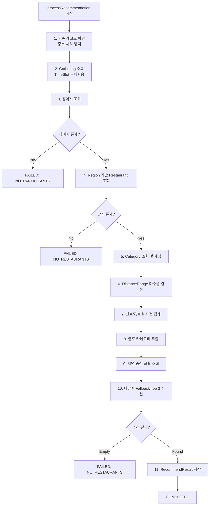
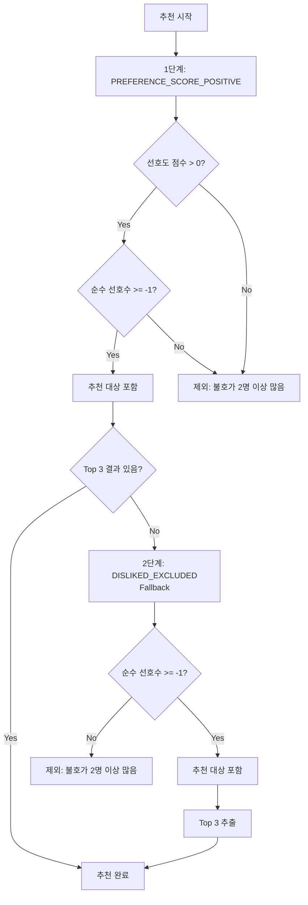
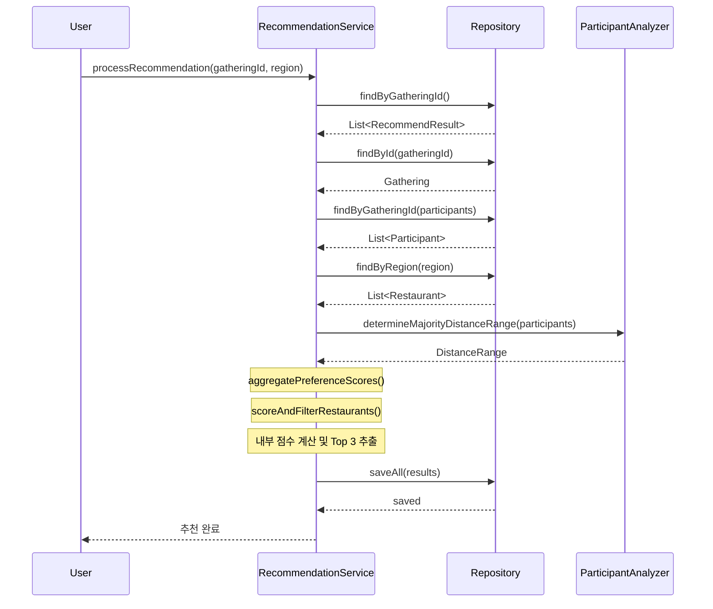

# 맛집 추천 시스템 아키텍처

## 개요

`RecommendationService.processRecommendation()` 메서드는 모임(Gathering)에 참여한 참가자들의 선호도를 분석하여 최적의 맛집 Top 3를 추천하는 핵심 비즈니스 로직입니다.

---

## 전체 처리 흐름



---

## 점수 계산 요소 및 가중치

### 1. 선호도 점수 (Preference Score)

참여자가 선택한 카테고리 순위에 따라 점수가 부여됩니다.

| 순위 | 가중치 |
|:----:|:------:|
| 1순위 | **+3.0점** |
| 2순위 | **+2.0점** |
| 3순위 | **+1.0점** |

**불호(Dislike) 페널티**: **-2.0점** (per dislike)

**계산식**: `totalPreferenceScore - (dislikeCount × 2.0)`

---

### 2. 순수 선호수 가산점 (Net Preference Bonus)

순수 선호수 = 선호자 수 - 불호자 수

| 조건 | 가산점 |
|:-----|:------:|
| 순수 선호 > 0 | **+1.0점 × 순수 선호수** |
| 순수 선호 = 0 (중립) | **-0.5점** |
| 순수 선호 < 0 | **-2.0점 × |순수 선호수|** (강한 페널티) |

---

### 3. 신뢰도 점수 (Credibility Score)

Wilson Score 기반 간소화 버전으로, 리뷰 수가 많고 평점이 높은 맛집을 우선합니다.
**블로그 리뷰는 일반 리뷰보다 상세하므로 1.5배 가중치를 적용합니다.**

```
4.5점 100개 리뷰 > 5.0점 1개 리뷰
```

**계산식**:
```java
카카오 리뷰 가중치 = log₁₀(reviewCount + 1)
// 100개 → 2.0, 1000개 → 3.0

블로그 리뷰 가중치 = log₁₀(blogReviewCount + 1) × 1.5
// 블로그 리뷰는 더 상세하므로 1.5배 가중

총 리뷰 가중치 = min(카카오 가중치 + 블로그 가중치, 5.0)
// 최대 5.0으로 제한

정규화 평점 = (rating - 3.0) / 2.0
// 3.0~5.0 → 0.0~1.0으로 정규화

신뢰도 점수 = 정규화 평점 × 총 리뷰 가중치
```

---

### 4. 거리 가산점 (Distance Bonus)

참여자 다수결로 결정된 거리 범위 내에 위치한 맛집에 가산점을 부여합니다.

| 거리 범위 | 조건 | 가산점 |
|:----------|:-----|:------:|
| RANGE_500M | 500m 이내 | **+1.0점** |
| RANGE_1KM | 1km 이내 | **+1.0점** |
| ANY | 제한 없음 | 가산점 없음 |

**거리 다수결**: 참여자들의 `distanceRange` 값 중 가장 많이 선택된 값으로 결정

---

### 5. 의견일치율 가산점 (Agreement Rate Bonus)

```
의견일치율 = (해당 카테고리 선호자 수 / 총 참여자 수) × 100%
가산점 = 의견일치율 / 100.0  (0~1점 범위)
```

예: 5명 중 3명이 한식 선택 → 60% → **+0.6점**

---

### 6. AI 요약 부스트 (AI Summary Boost)

`aiMateSummaryContents` JSON 배열에서 키워드를 추출하여 그룹 특성과 매칭합니다.

| 조건 | 가산점 |
|:-----|:------:|
| 참여자 4명 이상 + "단체석", "대형 테이블" 키워드 | **+0.5점** |
| "추천", "인기", "맛집" 등 긍정 키워드 | **+0.3점** |
| "웨이팅 필수", "예약 필수" 등 부정 키워드 | **-0.2점** |

---

### 7. 메뉴 다양성 부스트 (Menu Diversity Boost)

Top 3 추천 시 메뉴 타입이 중복되지 않도록 **Post-processing Diversification** 패턴을 적용합니다.

**알고리즘**:
1. 다양성 부스트 없이 기본 점수로 상위 후보 10개 선정
2. 후보 중에서 Greedy 방식으로 Top 3 선정 시 다양성 부스트 적용

| 조건 | 가산점 |
|:-----|:------:|
| 이미 선택된 메뉴 타입과 다른 경우 | **+0.5점** |
| 이미 선택된 메뉴 타입과 같은 경우 | 0점 |

**메뉴 타입 분류**: 튀김류, 탕류, 면류, 구이류, 회류, 볶음류, 디저트류, 양식류, 치킨류, 기타

> ⚠️ 이전 버전에서는 점수 계산과 타입 추적 시점이 불일치하여 순서 의존적인 버그가 있었습니다.
> 현재 버전에서는 Post-processing 패턴을 적용하여 순서에 독립적인 결정을 보장합니다.

---

### 8. Cold Start 부스트 (Cold Start Boost)

신규 맛집이 리뷰 부족으로 불이익을 받지 않도록 가산점을 부여합니다.

**신규 맛집 판단 기준**:
- 등록일(`createdAt`)이 **30일 이내**, 또는
- 리뷰 수가 **10개 미만**

**부스트 조건**:
| 조건 | 가산점 |
|:-----|:------:|
| 신규 맛집 + 평점 ≥ 4.0 | **+0.3점** |
| 신규 맛집 + 평점 < 4.0 | 0점 (관망) |
| 기존 맛집 | 0점 |

> 💡 평점이 좋은 신규 맛집에만 부스트를 적용하여, 잠재력 있는 맛집을 발굴합니다.

---

### 9. Freshness 부스트 (Freshness Boost)

정보가 최신인 맛집을 우선하고, 오래된 정보에는 페널티를 부여합니다.

**업데이트 시점 기준** (`updatedAt`):
| 기간 | 부스트 |
|:-----|:------:|
| 7일 이내 | **+0.3점** (최신) |
| 30일 이내 | **+0.1점** (보통) |
| 30~90일 | 0점 |
| 90일 이상 | **-0.2점** (정보 오래됨) |

> 💡 카카오맵 동기화로 정보가 갱신되면 `updatedAt`이 업데이트되어 자동으로 Freshness 점수에 반영됩니다.

---

## 최종 점수 계산

```
totalScore = 선호도 점수
           + 순수 선호수 가산점
           + 신뢰도 점수 (blogReviewCount 반영)
           + 거리 가산점 (범위 내: +1.0)
           + 의견일치율 가산점 (0~1)
           + AI 요약 부스트 (-0.2 ~ +0.8)
           + Cold Start 부스트 (0 or +0.3)
           + Freshness 부스트 (-0.2 ~ +0.3)
           + 메뉴 다양성 부스트 (0 or +0.5, Post-processing 단계)
```

**소수점 셋째 자리 반올림** 적용

### 점수 범위 요약

| 요소 | 최소 | 최대 | 비고 |
|:-----|:----:|:----:|:-----|
| 선호도 점수 | 0 | +9.0 | 3명 모두 1순위 시 |
| 순수 선호수 가산점 | -∞ | +∞ | 참여자 수에 비례 |
| 신뢰도 점수 | 0 | +5.0 | 평점×리뷰가중치 |
| 거리 가산점 | 0 | +1.0 | 범위 내 |
| 의견일치율 가산점 | 0 | +1.0 | 100%일 때 |
| AI 요약 부스트 | -0.2 | +0.8 | 키워드 매칭 |
| Cold Start 부스트 | 0 | +0.3 | 신규 맛집 |
| Freshness 부스트 | -0.2 | +0.3 | 정보 신선도 |
| 메뉴 다양성 부스트 | 0 | +0.5 | Post-processing |

---

## 필터링 로직

### TimeSlot 필터링 (최우선)

모임의 시간대와 맛집의 운영 시간대가 호환되어야 합니다.

| 모임 TimeSlot | 맛집 TimeSlot | 호환 여부 |
|:--------------|:--------------|:---------:|
| LUNCH | LUNCH | O |
| LUNCH | DINNER | X |
| LUNCH | BOTH | O |
| DINNER | LUNCH | X |
| DINNER | DINNER | O |
| DINNER | BOTH | O |
| BOTH | * | O (모두 허용) |

---

### 다단계 Fallback 전략



---

## 추천 근거 텍스트 생성

추천 결과와 함께 사용자에게 보여줄 근거 텍스트가 자동 생성됩니다.

**형식**:
```
{총 참여자}명 중 {선호자 수}명이 {카테고리}을 골라서
{AI 요약 타이틀}
을(를) 추천해요
```

**예시**:
```
5명 중 3명이 일식을 골라서
400시간 숙성으로 완성한 겉바속촉 돈카츠
을(를) 추천해요
```

---

## Top-K 알고리즘

PriorityQueue(Min-Heap)를 사용하여 **O(N log K)** 시간 복잡도로 상위 3개 맛집을 추출합니다.

```java
if (heap.size() < 3) {
    heap.offer(scored);
} else if (scored.totalScore() > heap.peek().totalScore()) {
    heap.poll();
    heap.offer(scored);
}
```

---

## 성능 최적화

### 선호도 사전 집계

기존: O(R × P × 3) — 레스토랑마다 모든 참여자의 선호도 순회

개선: O(P × 3) + O(R) — 선호도를 미리 Map으로 집계 후 레스토랑별 조회

```java
Map<String, PreferenceScore> preferenceScoreMap = aggregatePreferenceScores(participants);
```

### Category 캐싱

Spring Cache를 적용하여 Category 조회 결과를 캐싱합니다.

---

## 관련 클래스

| 클래스 | 역할 |
|:-------|:-----|
| `RecommendationService` | 추천 로직 핵심 서비스 |
| `PreferenceScore` | 카테고리별 선호도 점수 값 객체 |
| `ScoredRestaurant` | 점수가 계산된 레스토랑 래퍼 |
| `ParticipantAnalyzer` | 참여자 분석 (거리 다수결 등) |
| `RecommendResult` | 추천 결과 도메인 |

---

## 상수 정의 (RecommendationService)

코드 가독성과 유지보수를 위해 모든 가중치와 임계값이 상수로 정의되어 있습니다.

```java
// 점수 가중치
private static final double DISTANCE_BONUS = 1.0;
private static final double DIVERSITY_BONUS = 0.5;

// AI 요약 부스트
private static final double AI_GROUP_BOOST = 0.5;
private static final double AI_POSITIVE_BOOST = 0.3;
private static final double AI_NEGATIVE_PENALTY = -0.2;
private static final int GROUP_SIZE_THRESHOLD = 4;

// Cold Start
private static final int COLD_START_DAYS_THRESHOLD = 30;
private static final int COLD_START_REVIEW_THRESHOLD = 10;
private static final double COLD_START_RATING_THRESHOLD = 4.0;
private static final double COLD_START_BOOST = 0.3;

// Freshness
private static final int FRESHNESS_RECENT_DAYS = 7;
private static final int FRESHNESS_MODERATE_DAYS = 30;
private static final int FRESHNESS_STALE_DAYS = 90;
private static final double FRESHNESS_RECENT_BOOST = 0.3;
private static final double FRESHNESS_MODERATE_BOOST = 0.1;
private static final double FRESHNESS_STALE_PENALTY = -0.2;

// 후보 선정
private static final int CANDIDATE_POOL_SIZE = 10;
private static final int TOP_K_SIZE = 3;
```

---

## 실패 처리

| FailureReason | 설명 |
|:--------------|:-----|
| `NO_PARTICIPANTS` | 참여자가 없음 |
| `NO_RESTAURANTS` | 해당 지역에 맛집이 없거나 필터링 후 적합한 맛집이 없음 |
| `PROCESSING_EXCEPTION` | 처리 중 예외 발생 |

실패 시 `RecommendResultFailed` 테이블에 실패 사유와 함께 저장됩니다.

---

## 시퀀스 다이어그램


