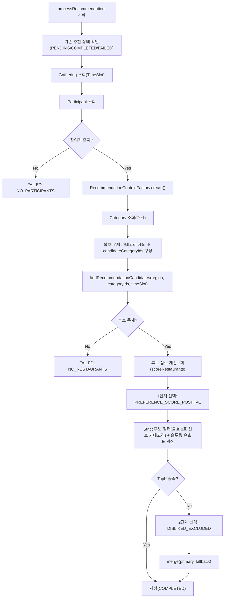

# 맛집 추천 시스템 아키텍처

> 최종 업데이트: 2026-03-03

## 개요

현재 추천 파이프라인의 진입점은 `RecommendationProcessor.processRecommendation()` 입니다.  
모임 참여자의 선호/불호/거리 선호를 집계해 Top 3 맛집을 산출하고, 결과를 `RecommendResult`에 저장합니다.

핵심 목표는 아래 3가지입니다.

1. 선호 투표 비율을 반영한 카테고리 안배 추천
2. 불호 우세 카테고리 제거
3. Top3 보장과 선호 우선 정책의 균형 유지(Strict + Fallback)

---

## 핵심 컴포넌트

| 컴포넌트 | 역할 |
|:--|:--|
| `RecommendationProcessor` | 추천 처리 오케스트레이션, 점수 계산, fallback 제어 |
| `RecommendationContextFactory` | 참여자 입력을 추천용 파생 컨텍스트로 집계 |
| `RecommendationSelectionStrategy` | Top-K 선정 전략 인터페이스 |
| `CategoryQuotaSelectionStrategy` | 카테고리 투표 비율 기반 슬롯 배분(최대 나머지 방식) |
| `RecommendationScoringPolicy` | 가중치/임계값 정책 객체(Record) |
| `PreferenceScore` | 카테고리별 선호 점수 + 선호자/불호자 카운트 값 객체 |
| `CategoryVoteSummary` | 카테고리별 선호표/불호표/제외 카테고리 |
| `DistanceScoreContext` | 거리 다수결 결과 + ANY 비중 반영 가중치 |

---

## 처리 흐름



---

## 점수 모델

최종 점수는 아래 요소의 합이며, 소수점 셋째 자리 반올림을 적용합니다.

```text
totalScore
 = 선호도 점수
 + 순수 선호수 가산점
 + 신뢰도 점수
 + 거리 가산점(ANY 비중 반영)
 + 의견일치율 가산점
 + AI 요약 부스트
 + Cold Start 부스트
 + Freshness 부스트
```

### 1) 선호도 점수

| 항목 | 값 |
|:--|:--|
| 1순위 선호 | +3.0 |
| 2순위 선호 | +2.0 |
| 3순위 선호 | +1.0 |
| 불호 | -2.0 (개수당) |

계산식:

```text
preferenceScore = totalPreferenceScore - (dislikeCount * 2.0)
```

### 2) 순수 선호수 가산점

```text
netPreference = preferenceCount - dislikeCount
if netPreference > 0  -> +1.0 * netPreference
if netPreference = 0  -> -0.5
if netPreference < 0  -> +2.0 * netPreference (음수 페널티)
```

### 3) 신뢰도 점수

```text
kakaoWeight = log10(reviewCount + 1)
blogWeight = log10(blogReviewCount + 1) * 1.5
totalWeight = min(kakaoWeight + blogWeight, 5.0)
normalizedRating = clamp((rating - 3.0) / (5.0 - 3.0), 0.0, 1.0)
credibility = normalizedRating * totalWeight
```

### 4) 거리 가산점 (ANY 비중 반영)

거리 다수결은 `RANGE_500M` vs `RANGE_1KM`로 결정하며, 동률은 `RANGE_500M` 우선입니다.  
`ANY` 선택 비중이 높을수록 거리 보너스를 선형 축소합니다.

```text
anyRatio = anyCount / participantCount
effectiveDistanceBonus = distanceBonus * (1 - anyRatio)
```

| 예시 | effectiveDistanceBonus |
|:--|:--|
| ANY 0% | 1.0 |
| ANY 50% | 0.5 |
| ANY 100% | 0.0 |

### 5) 의견일치율 가산점

```text
agreementRate = (해당 카테고리 선호자 수 / 총 참여자 수) * 100
agreementBonus = agreementRate / 100
```

### 6) AI 요약 부스트

| 조건 | 점수 |
|:--|:--|
| 참여자 수 >= 4 + 단체 키워드(단체석/대형 테이블/모임/단체) | +0.5 |
| 긍정 키워드(추천/인기/맛집/특별/유명) | +0.3 |
| 부정 키워드(웨이팅 필수/예약 필수/대기 시간) | -0.2 |

### 7) Cold Start + Freshness

| 항목 | 규칙 |
|:--|:--|
| Cold Start | 등록 30일 이내 또는 리뷰 10개 미만이며 평점 4.0 이상이면 +0.3 |
| Freshness | 7일 이내 +0.3, 30일 이내 +0.1, 90일 이상 -0.2 |

참고: `RecommendationScoringPolicy`에 `diversityBonus` 파라미터가 정의되어 있으나, 현재 점수 합산에는 사용하지 않습니다.

---

## 카테고리 필터링 정책

`RecommendationContextFactory`가 카테고리별 선호표/불호표를 집계하고, 아래 규칙으로 추천 제외 카테고리를 결정합니다.

1. `dislikeCount > preferenceCount` 인 카테고리 제외
2. `preferenceCount = 0 && dislikeCount > 0` 인 카테고리 제외

이 제외 카테고리는 추천 후보 조회 전에 SQL 조건으로 먼저 반영합니다.

입력 매핑 규칙:

1. `LargeCategory.displayName` 기준 입력(예: `아시안`)을 처리
2. enum name 입력(예: `ASIAN`)도 처리
3. 그 외 별칭 문자열은 현재 별도 정규화하지 않음

---

## Top-K 선정 알고리즘

`RecommendationProcessor` + `CategoryQuotaSelectionStrategy` 조합으로 Top-K를 결정합니다.

### 1) Strict 후보 우선 규칙 (`applyNoDislikePreferredFilter`)

선호 카테고리 중 `dislikeVotes == 0`인 카테고리가 있으면 strict 후보로 우선 사용합니다.

1. strict 카테고리가 없으면 전체 후보 유지
2. strict 후보가 비어있으면 전체 후보 유지
3. strict 후보 수가 `topK` 미만이면 Top3 보장을 위해 전체 후보로 복귀
4. strict 후보 수가 `topK` 이상이면 strict 후보만 사용

### 2) 슬롯 배분용 유효표 산정 (`buildQuotaPreferenceVotes`)

카테고리 슬롯 비율은 아래 우선순위로 투표값을 사용합니다.

1. 가중 선호 유효표: `round(totalPreferenceScore) - dislikeVotes * 2` (0 미만은 0으로 절삭)
2. 위가 전부 0이면 단순 선호표(`preferenceVotes`)
3. 선호 입력 자체가 없으면 후보 카테고리 균등표(카테고리당 1표)

### 3) `CategoryQuotaSelectionStrategy` 슬롯 배분

1. 카테고리별 후보를 점수순 정렬하고 카테고리당 최대 `candidatePoolSize(10)`개 유지
2. `rawQuota = (categoryVotes / totalVotes) * topK(3)` 계산
3. 바닥값 슬롯 우선 할당
4. 남은 슬롯은 최대 나머지 방식으로 배분
5. 슬롯으로 부족하면
: 먼저 quota 카테고리 내부에서 점수순 보강
: 그래도 부족하면 전체 카테고리에서 점수순 보강해 TopK를 채움

이 방식으로 `일식 3표, 아시안 2표`일 때 Top3 슬롯은 `2:1`로 배분됩니다.

---

## 쿼리/메모리 최적화

### 1) 추천 후보 전용 쿼리 도입

기존은 `findByRegion()`으로 지역 전체 맛집을 메모리로 가져온 뒤 자바에서 필터링했습니다.  
현재는 `findRecommendationCandidates(region, categoryIds, timeSlot)`로 SQL 선필터링을 수행합니다.

적용 조건:

1. `deleted_at IS NULL`
2. `region = ?`
3. `category_id IN (?)`
4. `time_slot IS NULL OR time_slot = BOTH OR time_slot = gatheringTimeSlot`

또한 추천 계산에 필요한 컬럼만 projection 조회해 row 폭을 줄였습니다.

### 2) fallback 점수 계산 중복 제거

기존에는 1단계/2단계 fallback 각각에서 점수 계산을 반복했습니다.  
현재는 `scoreRestaurants()`로 점수 계산 1회 후, 전략별 필터만 분기합니다.

### 3) Category 캐시

`CategoryService.findAll()`에 `@Cacheable("categories")`를 적용했고, 카테고리 생성 시 캐시를 비웁니다.  
`CacheManager`는 `ObjectProvider`로 optional 처리해 컨텍스트별 빈 유무 차이에도 안전합니다.

---

## 시간/공간 복잡도

기호:

| 기호 | 의미 |
|:--|:--|
| `P` | 참여자 수 |
| `M` | 카테고리 수 |
| `R` | 쿼리 후 추천 후보 맛집 수 |
| `S` | 투표에 등장한 카테고리 수 (`S <= M`) |
| `K` | 최종 추천 개수 (`K = 3`) |

### 현재 복잡도

| 단계 | 시간 복잡도 | 공간 복잡도 |
|:--|:--|:--|
| 참여자 컨텍스트 집계 | `O(P)` | `O(M)` |
| 카테고리 맵/후보 카테고리 구성 | `O(M)` | `O(M)` |
| 후보 점수 계산 1회 | `O(R)` | `O(R)` |
| 카테고리 버킷 정렬/슬롯 배분 | 최악 `O(R log R) + O(S log S)` | `O(R + S)` |
| fallback 병합 | `O(K)` | `O(K)` |

총합(지배항):

```text
Time: O(P + M + R log R)
Space: O(M + R)
```

`K=3`, `candidatePoolSize=10`이 고정이므로 실제 런타임은 `R`과 카테고리 분포에 가장 민감합니다.

### 개선 전/후 관점

| 항목 | 이전 | 현재 |
|:--|:--|:--|
| DB 조회 범위 | 지역 전체 | 지역+카테고리+TimeSlot 선필터링 |
| fallback 점수 계산 | 최대 2회 | 1회 |
| 카테고리 조회 | 매번 DB hit | 캐시 기반 |
| 선호도 집계 | 레스토랑 루프 내부 반복 위험 | 사전 집계 컨텍스트 재사용 |

---

## 사용 기술

| 구분 | 기술 |
|:--|:--|
| 언어/모델 | Java Record 기반 Value Object |
| 프레임워크 | Spring Boot, Spring Transactional, Spring Cache |
| 데이터 접근 | Spring Data JPA, QueryDSL |
| 지리 계산 | GeoJson + Haversine(`GeoUtils`) |
| 패턴 | Strategy(`RecommendationSelectionStrategy`), Context Factory(`RecommendationContextFactory`), Processor Orchestration |
| 테스트 | JUnit 5, Mockito |

---

## 실패 처리

| FailureReason | 의미 |
|:--|:--|
| `NO_PARTICIPANTS` | 참여자 없음 |
| `NO_RESTAURANTS` | 후보가 없거나 필터링 후 추천 불가 |
| `PROCESSING_EXCEPTION` | 처리 중 예외 |

실패 시:

1. `t_recommend_result`에 `FAILED` 상태 저장
2. `t_recommend_result_failed`에 상세 실패 컨텍스트 저장

---

## 테스트 포인트

현재 핵심 시나리오는 아래 테스트로 검증합니다.

1. `RecommendationContextFactoryScenarioTest`
: Case 1~12 시나리오의 제외 카테고리 계산 검증
2. `RecommendationProcessorTest`
: 선호표 비율 슬롯 배분(3:2 -> 2:1)
: Case 11(`한식 4표/양식 2표 -> 2:1`)
: strict 후보 우선(불호 0표 선호 카테고리) 및 strict 후보 부족 시 Top3 보강
: 가중 선호 유효표 기반 동률 우선순위
: 선호 중립 입력(상관없음)에서도 Top3 반환
: ANY 비중에 따른 거리 보너스 선형 축소
: 후보 조회 시 category/timeSlot 선필터 파라미터 전달
3. `CategoryQuotaSelectionStrategyTest`
: 동률 카테고리 슬롯 분산
: 선호 후보 부족 시 비선호 카테고리 보강으로 TopK 충족
