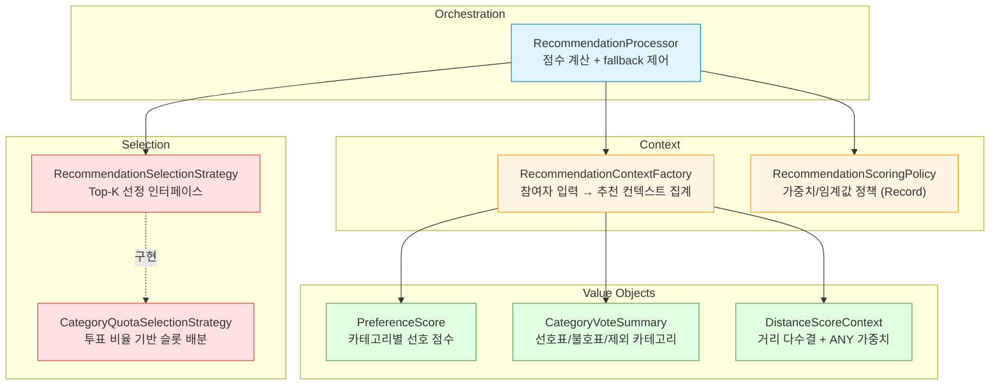
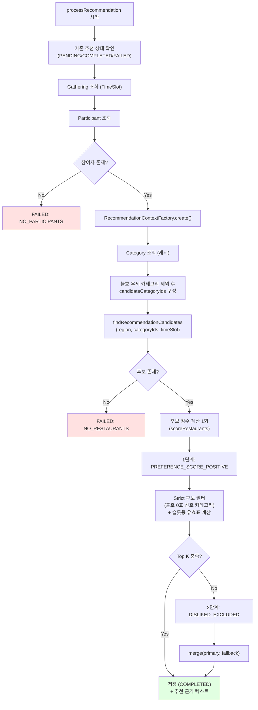

# 맛집 추천 시스템 아키텍처

> 최종 업데이트: 2026-03-09

## 왜 직접 추천 알고리즘을 설계했는가

Yogieat의 추천 시스템은 외부 ML 서비스 없이 **순수 Java 로직으로 구현한 다요소 점수 기반 추천 엔진**입니다.

| 판단 기준 | 선택 | 이유 |
|:--|:--|:--|
| 추천 방식 | 규칙 기반 점수 모델 | 소규모 서비스에서 ML 모델 학습 데이터가 부족하고, 투표 기반 입력은 규칙이 명확함 |
| 다양성 보장 | 카테고리 쿼터 슬롯 배분 | 단순 점수 정렬 시 한 카테고리에 편중되는 문제를 투표 비율 기반 슬롯으로 해결 |
| 가용성 보장 | 다단계 Fallback | 엄격한 필터링으로 Top 3를 못 채우는 상황을 방지 |
| AI 활용 | Gemini 요약 → 점수 부스트 | AI 요약 키워드를 점수에 반영하여 단체 모임, 인기 맛집 등 맥락을 반영 |

---

## 개요

추천 파이프라인의 진입점은 `RecommendationProcessor.processRecommendation()` 입니다.
모임 참여자의 선호/불호/거리 선호를 집계해 **Top 3 맛집을 자동 산출**하고, 결과를 `RecommendResult`에 저장합니다.

핵심 목표:

1. **선호 투표 비율을 반영한 카테고리 안배 추천** — 일식 3표, 아시안 2표이면 슬롯 2:1 배분
2. **불호 우세 카테고리 제거** — 불호가 선호보다 많으면 SQL 단계에서 사전 제외
3. **Top 3 보장과 선호 우선 정책의 균형** — Strict 필터 + Fallback 전략

---

## 핵심 컴포넌트



| 컴포넌트 | 역할 | 설계 패턴 |
|:--|:--|:--|
| `RecommendationProcessor` | 추천 처리 오케스트레이션, 점수 계산, fallback 제어 | Orchestrator |
| `RecommendationContextFactory` | 참여자 입력을 추천용 파생 컨텍스트로 집계 | Factory |
| `RecommendationSelectionStrategy` | Top-K 선정 전략 인터페이스 | Strategy (인터페이스) |
| `CategoryQuotaSelectionStrategy` | 카테고리 투표 비율 기반 슬롯 배분 (최대 나머지 방식) | Strategy (구현) |
| `RecommendationScoringPolicy` | 가중치/임계값 정책 객체 | Record (불변 정책) |
| `PreferenceScore` | 카테고리별 선호 점수 + 선호자/불호자 카운트 | Value Object |
| `CategoryVoteSummary` | 카테고리별 선호표/불호표/제외 카테고리 | Value Object |
| `DistanceScoreContext` | 거리 다수결 결과 + ANY 비중 반영 가중치 | Value Object |

---

## 처리 흐름



---

## 점수 모델

최종 점수는 8개 요소의 합이며, 소수점 셋째 자리에서 반올림합니다.

```text
totalScore
 = 선호도 점수
 + 순수 선호수 가산점
 + 신뢰도 점수
 + 거리 가산점 (ANY 비중 반영)
 + 의견일치율 가산점
 + AI 요약 부스트
 + Cold Start 부스트
 + Freshness 부스트
```

### 1) 선호도 점수 — 순위별 가중 투표

참여자가 선택한 카테고리 선호 순위에 따라 가중치를 부여합니다.

| 항목 | 값 |
|:--|:--|
| 1순위 선호 | +3.0 |
| 2순위 선호 | +2.0 |
| 3순위 선호 | +1.0 |
| 불호 | -2.0 (개수당) |

```text
preferenceScore = totalPreferenceScore - (dislikeCount * 2.0)
```

> **설계 의도**: 단순 투표수가 아닌 순위별 가중치를 적용하여, "1순위로 선택한 1표"가 "3순위 1표"보다 3배 영향력을 갖도록 했습니다.

### 2) 순수 선호수 가산점 — 찬반 균형 보정

```text
netPreference = preferenceCount - dislikeCount
if netPreference > 0  → +1.0 × netPreference
if netPreference = 0  → -0.5
if netPreference < 0  → +2.0 × netPreference (음수 페널티)
```

### 3) 신뢰도 점수 — 리뷰 수 + 평점의 교차 검증

리뷰 수가 많고 평점이 높을수록 신뢰도가 올라갑니다. 로그 스케일을 적용하여 리뷰 1000개와 100개의 차이가 과도하게 벌어지지 않도록 합니다.

```text
kakaoWeight  = log10(reviewCount + 1)
blogWeight   = log10(blogReviewCount + 1) × 1.5
totalWeight  = min(kakaoWeight + blogWeight, 5.0)
normalizedRating = clamp((rating - 3.0) / (5.0 - 3.0), 0.0, 1.0)
credibility  = normalizedRating × totalWeight
```

> **설계 의도**: 블로그 리뷰는 일반 리뷰보다 상세하므로 1.5배 가중치를 적용했습니다. `log10` 스케일로 리뷰 수의 급격한 증가를 방지합니다.

### 4) 거리 가산점 — 다수결 + ANY 비중 반영

거리 다수결은 `RANGE_500M` vs `RANGE_1KM`로 결정하며, 동률 시 `RANGE_500M` 우선입니다.
`ANY` 선택 비중이 높을수록 거리 보너스를 선형으로 축소합니다.

```text
anyRatio = anyCount / participantCount
effectiveDistanceBonus = distanceBonus × (1 - anyRatio)
```

| 예시 | effectiveDistanceBonus |
|:--|:--|
| ANY 0% | 1.0 |
| ANY 50% | 0.5 |
| ANY 100% | 0.0 |

> **설계 의도**: "거리 상관없음" 선택이 많을수록 거리 요인의 영향력을 자연스럽게 줄여, 참여자 의사를 정확히 반영합니다.

### 5) 의견일치율 가산점

```text
agreementRate = (해당 카테고리 선호자 수 / 총 참여자 수) × 100
agreementBonus = agreementRate / 100
```

### 6) AI 요약 부스트 — Gemini 키워드 매칭

| 조건 | 점수 |
|:--|:--|
| 참여자 수 >= 4 + 단체 키워드(단체석/대형 테이블/모임/단체) | +0.5 |
| 긍정 키워드(추천/인기/맛집/특별/유명) | +0.3 |
| 부정 키워드(웨이팅 필수/예약 필수/대기 시간) | -0.2 |

### 7) Cold Start + Freshness

| 항목 | 규칙 |
|:--|:--|
| Cold Start | 등록 30일 이내 또는 리뷰 10개 미만이며, 평점 4.0 이상이면 +0.3 |
| Freshness | 7일 이내 +0.3, 30일 이내 +0.1, 90일 이상 -0.2 |

> **설계 의도**: Cold Start 부스트로 신규 맛집도 추천 대상에 포함되도록 하되, 평점 4.0 이상 조건으로 품질을 보장합니다. Freshness로 정보가 오래된 맛집에는 페널티를 부여합니다.

참고: `RecommendationScoringPolicy`에 `diversityBonus` 파라미터가 정의되어 있으나, 현재 점수 합산에는 사용하지 않습니다.

### 설정 오버라이드

`RecommendationScoringPolicy`는 `@ConfigurationProperties(prefix = "recommendation.scoring")`로 바인딩되어, `application.yaml`에서 모든 파라미터를 오버라이드할 수 있습니다. AI 요약 키워드(그룹/긍정/부정)도 설정으로 관리됩니다.

```yaml
recommendation:
  scoring:
    distance-bonus: 1.0
    ai-summary:
      group-size-threshold: 4
      group-keywords: ["단체석", "대형 테이블", "모임", "단체"]
      positive-keywords: ["추천", "인기", "맛집", "특별", "유명"]
      negative-keywords: ["웨이팅 필수", "예약 필수", "대기 시간"]
```

---

## 카테고리 필터링 정책

`RecommendationContextFactory`가 카테고리별 선호표/불호표를 집계하고, 아래 규칙으로 추천 제외 카테고리를 결정합니다.

1. `dislikeCount > preferenceCount` 인 카테고리 제외
2. `preferenceCount = 0 && dislikeCount > 0` 인 카테고리 제외

이 제외 카테고리는 추천 후보 조회 전에 **SQL 조건으로 사전 반영**합니다. 불필요한 데이터를 메모리에 올리지 않습니다.

입력 매핑 규칙:

1. `LargeCategory.displayName` 기준 입력(예: `아시안`)을 처리
2. enum name 입력(예: `ASIAN`)도 처리
3. 그 외 별칭 문자열은 현재 별도 정규화하지 않음

---

## Top-K 선정 알고리즘

`RecommendationProcessor` + `CategoryQuotaSelectionStrategy` 조합으로 Top-K를 결정합니다.

### 1) Strict 후보 우선 규칙 (`applyNoDislikePreferredFilter`)

선호 카테고리 중 `dislikeVotes == 0`인 카테고리가 있으면 strict 후보로 우선 사용합니다.

1. strict 카테고리가 없으면 전체 후보 유지
2. strict 후보가 비어있으면 전체 후보 유지
3. strict 후보 수가 `topK` 미만이면 Top 3 보장을 위해 전체 후보로 복귀
4. strict 후보 수가 `topK` 이상이면 strict 후보만 사용

> **설계 의도**: "아무도 싫어하지 않는 카테고리"를 우선 추천하여, 모임에서 불만이 최소화되는 결과를 도출합니다.

### 2) 슬롯 배분용 유효표 산정 (`buildQuotaPreferenceVotes`)

카테고리 슬롯 비율은 아래 우선순위로 투표값을 사용합니다.

1. **가중 선호 유효표**: `round(totalPreferenceScore) - dislikeVotes × 2` (0 미만은 0으로 절삭)
2. **단순 선호표**: 위가 전부 0이면 `preferenceVotes` 사용
3. **균등표**: 선호 입력 자체가 없으면 후보 카테고리당 1표

### 3) `CategoryQuotaSelectionStrategy` 슬롯 배분

1. 카테고리별 후보를 점수순 정렬하고, 카테고리당 최대 `candidatePoolSize(10)`개 유지
2. `rawQuota = (categoryVotes / totalVotes) × topK(3)` 계산
3. 바닥값 슬롯 우선 할당
4. 남은 슬롯은 **최대 나머지 방식(Largest Remainder Method)**으로 배분
5. 슬롯으로 부족하면: 먼저 quota 카테고리 내부에서 점수순 보강, 그래도 부족하면 전체 카테고리에서 점수순 보강하여 Top K를 채움

> **예시**: `일식 3표, 아시안 2표`일 때 Top 3 슬롯은 `2:1`로 배분됩니다.

---

## 추천 근거 텍스트

추천 결과에는 사용자에게 보여줄 **추천 근거 텍스트**(`reasonText`)가 함께 저장됩니다.

형식 예시:
```text
5명 중 3명이 일식을 골라서
400시간 숙성으로 완성한 겉바속촉 돈카츠
을(를) 추천해요
```

구성 요소:
1. **참여자 선호 정보** — "N명 중 M명이 {카테고리}를 골라서"
2. **AI 요약 타이틀** — Gemini가 생성한 맛집 한줄 요약
3. **마무리 멘트** — "을(를) 추천해요"

---

## 쿼리/메모리 최적화

### 1) 추천 후보 전용 쿼리

기존은 `findByRegion()`으로 지역 전체 맛집을 메모리로 가져온 뒤 Java에서 필터링했습니다.
현재는 `findRecommendationCandidates(region, categoryIds, timeSlot)`로 SQL 선필터링을 수행합니다.

적용 조건:

1. `deleted_at IS NULL`
2. `region = ?`
3. `category_id IN (?)`
4. `time_slot IS NULL OR time_slot = BOTH OR time_slot = gatheringTimeSlot`

또한 추천 계산에 필요한 컬럼만 projection 조회해 row 폭을 줄였습니다.

### 2) Fallback 점수 계산 중복 제거

기존에는 1단계/2단계 fallback 각각에서 점수 계산을 반복했습니다.
현재는 `scoreRestaurants()`로 **점수 계산 1회** 후, 전략별 필터만 분기합니다.

### 3) Category 캐시

`CategoryService.findAll()`에 `@Cacheable("categories")`를 적용하고, 카테고리 생성 시 캐시를 비웁니다.
`CacheManager`는 `ObjectProvider`로 optional 처리해 컨텍스트별 빈 유무 차이에도 안전합니다.

---

## 시간/공간 복잡도

| 기호 | 의미 |
|:--|:--|
| `P` | 참여자 수 |
| `M` | 카테고리 수 |
| `R` | 쿼리 후 추천 후보 맛집 수 |
| `S` | 투표에 등장한 카테고리 수 (`S <= M`) |
| `K` | 최종 추천 개수 (`K = 3`) |

### 현재 복잡도

| 단계 | 시간 복잡도 | 공간 복잡도 |
|:--|:--|:--|
| 참여자 컨텍스트 집계 | `O(P)` | `O(M)` |
| 카테고리 맵/후보 카테고리 구성 | `O(M)` | `O(M)` |
| 후보 점수 계산 1회 | `O(R)` | `O(R)` |
| 카테고리 버킷 정렬/슬롯 배분 | 최악 `O(R log R) + O(S log S)` | `O(R + S)` |
| fallback 병합 | `O(K)` | `O(K)` |

총합(지배항):

```text
Time:  O(P + M + R log R)
Space: O(M + R)
```

`K=3`, `candidatePoolSize=10`이 고정이므로 실제 런타임은 `R`과 카테고리 분포에 가장 민감합니다.

### 최적화 전/후 비교

| 항목 | 이전 | 현재 |
|:--|:--|:--|
| DB 조회 범위 | 지역 전체 | 지역+카테고리+TimeSlot 선필터링 |
| fallback 점수 계산 | 최대 2회 | 1회 |
| 카테고리 조회 | 매번 DB hit | 캐시 기반 |
| 선호도 집계 | 레스토랑 루프 내부 반복 위험 | 사전 집계 컨텍스트 재사용 |

---

## 사용 기술

| 구분 | 기술 |
|:--|:--|
| 언어/모델 | Java Record 기반 Value Object |
| 프레임워크 | Spring Boot, Spring Transactional, Spring Cache |
| 데이터 접근 | Spring Data JPA, QueryDSL |
| 지리 계산 | GeoJson + Haversine (`GeoUtils`) |
| 패턴 | Strategy (`RecommendationSelectionStrategy`), Factory (`RecommendationContextFactory`), Orchestrator (`RecommendationProcessor`) |
| 테스트 | JUnit 5, Mockito |

---

## 실패 처리

| FailureReason | 의미 |
|:--|:--|
| `NO_PARTICIPANTS` | 참여자 없음 |
| `NO_RESTAURANTS` | 후보가 없거나 필터링 후 추천 불가 |
| `PROCESSING_EXCEPTION` | 처리 중 예외 |

실패 시:

1. `t_recommend_result`에 `FAILED` 상태 저장
2. `t_recommend_result_failed`에 상세 실패 컨텍스트 저장 (실패 사유, 에러 메시지, 발생 시각)

---

## 테스트 커버리지

핵심 시나리오는 아래 테스트로 검증합니다.

**`RecommendationContextFactoryScenarioTest`**
- Case 1~12: 다양한 참여자 입력 조합에서 제외 카테고리 계산 검증

**`RecommendationProcessorTest`**
- 선호표 비율 슬롯 배분 (3:2 → 2:1)
- Case 11: 한식 4표/양식 2표 → 2:1 배분
- Strict 후보 우선 (불호 0표 선호 카테고리) 및 strict 후보 부족 시 Top 3 보강
- 가중 선호 유효표 기반 동률 우선순위
- 선호 중립 입력 ("상관없음")에서도 Top 3 반환
- ANY 비중에 따른 거리 보너스 선형 축소
- 후보 조회 시 category/timeSlot 선필터 파라미터 전달

**`CategoryQuotaSelectionStrategyTest`**
- 동률 카테고리 슬롯 분산
- 선호 후보 부족 시 비선호 카테고리 보강으로 Top K 충족
